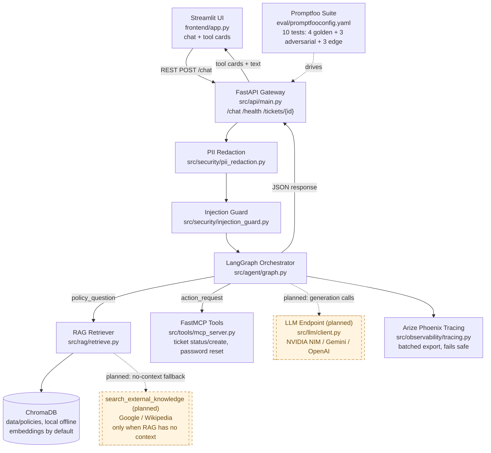
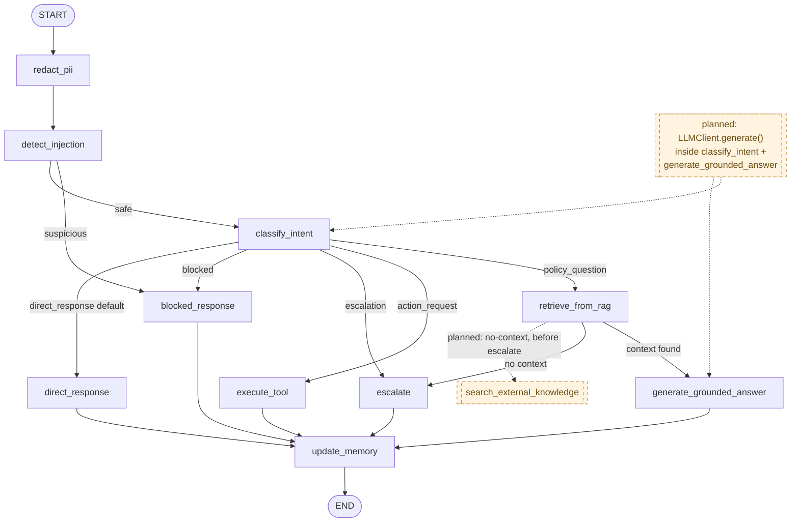

# System Architecture

Governed by `.specify/memory/constitution.md` v2.0.0. Solid boxes/edges = implemented and verified (2026-09-02). Dashed boxes/edges = spec'd, not yet built (tasks.md Phase 17).

A rendered, presentation-ready version of both diagrams is also published as an Artifact for demo day — see the link shared in chat.

## Figure 1 — Layered Architecture and Data Flow

## Figure 2 — Agent State Flow (LangGraph, `src/agent/graph.py`)

**Note vs. the original spec's LangGraph diagram** (`specs/001-it-support-ticketing-system/plan.md`): the shipped graph does not yet have a separate `load_session_memory` node or a `validate_structured_output` gate — routing decisions and generation are currently keyword/template-based, not model-based, so there is nothing to validate for schema drift yet. Both will matter once the real LLM call (Phase 17) lands.

## Exporting to PNG for the submission checklist

Section 23.2 of the project guide asks for `/docs/architecture.png` and `/docs/langgraph_state.png`. Easiest paths:
- VS Code: install the "Markdown Preview Mermaid Support" extension, open this file's preview, right-click each diagram → *Save image*.
- Or open the published Artifact (renders both diagrams) and take a browser screenshot of each figure.
