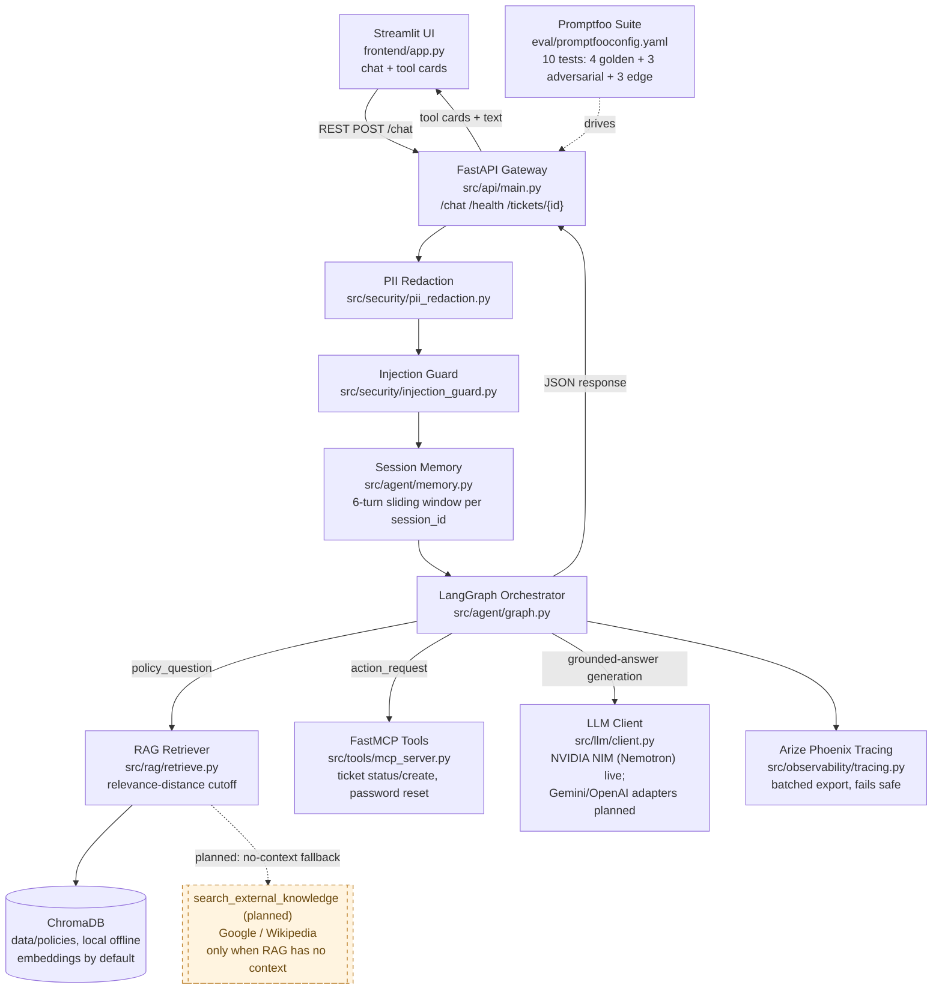
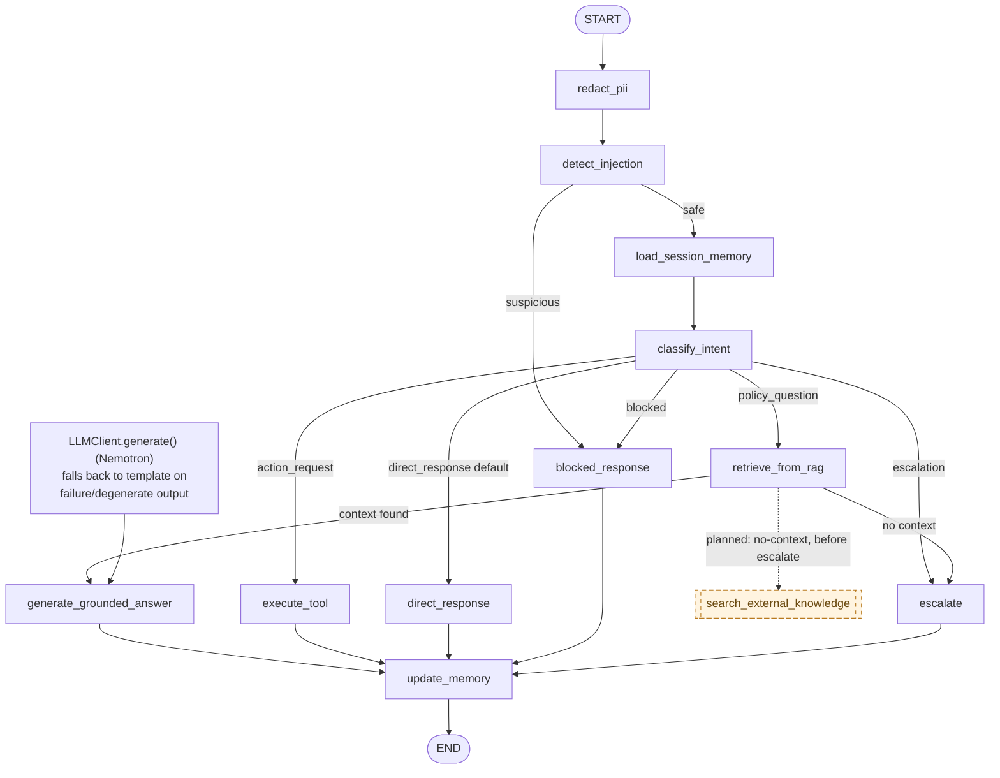

# System Architecture

Governed by `.specify/memory/constitution.md` v2.0.0. Solid boxes/edges = implemented and verified (2026-09-04). Dashed boxes/edges = spec'd, not yet built (tasks.md Phase 17).

A rendered, presentation-ready version of both diagrams is also published as an Artifact for demo day — see the link shared in chat.

## Figure 1 — Layered Architecture and Data Flow



## Figure 2 — Agent State Flow (LangGraph, `src/agent/graph.py`)



**Note vs. the original spec's LangGraph diagram** (`specs/001-it-support-ticketing-system/plan.md`): `load_session_memory` (US-008) and the real `LLMClient.generate()` call inside `generate_grounded_answer` are both now shipped and live. `classify_intent` and `execute_tool` routing remain deterministic keyword rules by design (Constitution Principle IV — guardrails/routing run before any model call), not a gap. There is still no separate `validate_structured_output` gate — Pydantic validation happens inline in the tool schemas (`src/schemas/models.py`) instead of as its own graph node.

## PNG exports for the submission checklist

Section 23.2 of the project guide asks for `/docs/architecture.png` and `/docs/langgraph_state.png` — both are committed and generated from `docs/_figure1_architecture.mmd` / `docs/_figure2_langgraph.mmd` (kept in sync with the Mermaid source above). Regenerate after editing either diagram:

```powershell
npx -y @mermaid-js/mermaid-cli -i docs/_figure1_architecture.mmd -o docs/architecture.png -b white -s 2
npx -y @mermaid-js/mermaid-cli -i docs/_figure2_langgraph.mmd -o docs/langgraph_state.png -b white -s 2
```
