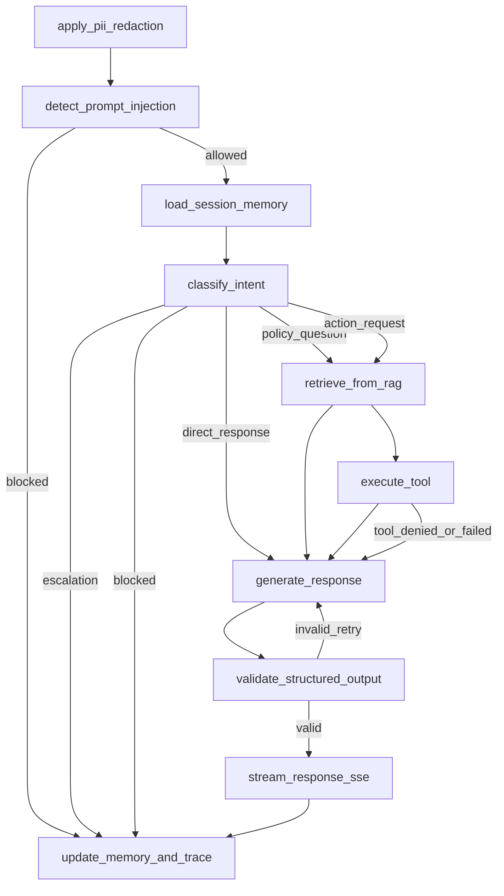

# Contract: LangGraph Workflow and Routing

## Canonical Nodes
1. apply_pii_redaction
2. detect_prompt_injection
3. load_session_memory
4. classify_intent
5. retrieve_from_rag
6. execute_tool
7. generate_response
8. validate_structured_output
9. stream_response_sse
10. update_memory_and_trace

## Intent Labels
- policy_question
- action_request
- direct_response
- escalation
- blocked

## State Diagram

## Edge Semantics
- apply_pii_redaction -> detect_prompt_injection: always.
- detect_prompt_injection -> blocked: risk above threshold.
- classify_intent -> policy_question: retrieval required.
- classify_intent -> action_request: retrieval + optional tool path.
- classify_intent -> direct_response: generation from sanitized context + memory.
- classify_intent -> escalation: human handoff terminal route.
- classify_intent -> blocked: policy-denied terminal route.
- validate_structured_output -> generate_response: repair loop for invalid schema output.
- stream_response_sse -> update_memory_and_trace: required terminal completion.

## Required Metadata
- correlation_id
- tenant_id
- ticket_id
- route_id
- intent_label
