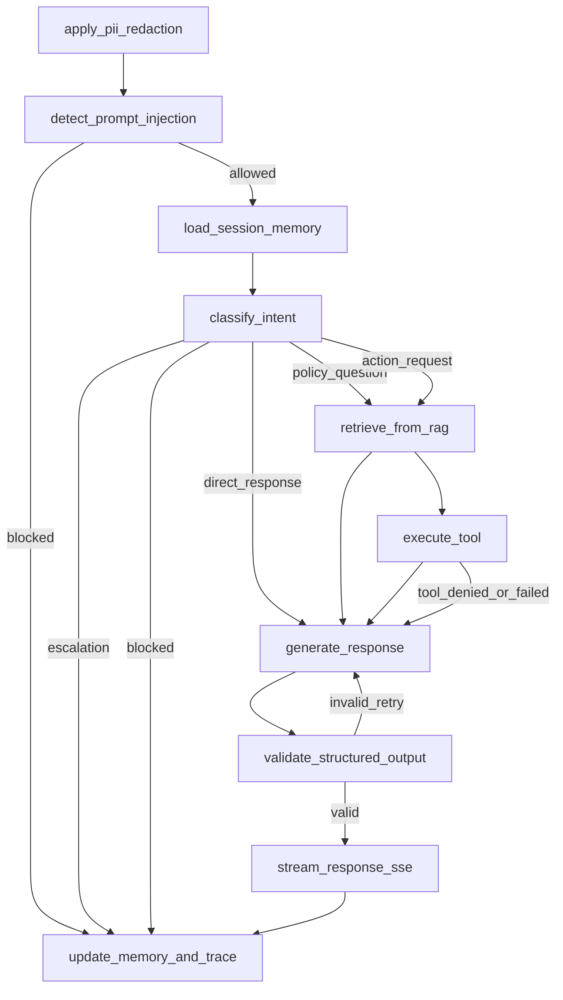

# Implementation Plan: IT Support Ticketing System

**Branch**: `001-it-support-ticketing-system` | **Date**: 2026-08-27 | **Spec**: `/specs/001-it-support-ticketing-system/spec.md`

**Input**: Feature specification from `/specs/001-it-support-ticketing-system/spec.md`

## Summary

Deliver a constitution-aligned IT support system using Streamlit, FastAPI, LangGraph, a provider-agnostic LLM client (NVIDIA NIM / Gemini / OpenAI), ChromaDB (with Pinecone as a swappable adapter), FastMCP (ticketing tools plus an external Google/Wikipedia search tool), Promptfoo, and Arize Phoenix, with mandatory safety and governance controls.

## Technical Context

**Language/Version**:
- Backend: Python 3.11+
- Frontend: Streamlit (Python), no separate TypeScript build

**Primary Dependencies**:
- FastAPI, Uvicorn, Pydantic v2
- LangGraph
- LLM provider client abstraction (`src/llm/`) targeting NVIDIA NIM, Gemini, or OpenAI, selected via `LLM_PROVIDER` env var
- ChromaDB client (Pinecone adapter optional/swappable behind the same retriever interface)
- FastMCP runtime (ticket tools + external search tool)
- Promptfoo
- Arize Phoenix SDK

**Storage**:
- Ticket metadata store
- ChromaDB (or Pinecone) for retrieval
- Workflow memory store

**Testing**:
- pytest + pytest-asyncio
- Streamlit UI exercised via manual/demo script (no separate frontend test runner)
- Contract, integration, security, and evaluation suites

**Target Platform**:
- Internal enterprise web app

**Project Type**:
- Full-stack web application

**Performance Goals**:
- p95 first response <= 60 seconds
- p95 stream start <= 2 seconds

**Constraints**:
- Tenant isolation everywhere
- Redaction before model invocation
- Injection checks before response generation
- Deny-by-default tool execution

**Scale/Scope**:
- 5k to 20k tickets/month (initial)

## Constitution Check (Pre-Research)

- I. Policy-Grounded RAG Answers: PASS
- II. Secure FastMCP Tool Execution: PASS
- III. PII Redaction Before LLM Prompts: PASS
- IV. Prompt Injection Resistance: PASS
- V. LangGraph Stateful Routing: PASS
- VI. Arize Phoenix Observability: PASS
- VII. Promptfoo Evaluation Gates: PASS
- VIII. Streamlit UI with Tool Cards: PASS
- IX. Provider-Agnostic LLM Invocation: PASS
- X. Honest Copilot Documentation: PASS

## Project Structure

### Documentation (this feature)

```text
specs/001-it-support-ticketing-system/
├── spec.md
├── plan.md
├── research.md
├── data-model.md
├── quickstart.md
├── contracts/
│   ├── langgraph-workflow.md
│   └── rag-and-tools.md
└── tasks.md
```

### Source Code (repository root)

```text
src/
├── api/
├── agent/            # LangGraph state, nodes, routing
├── llm/               # provider-agnostic client (NVIDIA NIM / Gemini / OpenAI)
├── rag/                # ChromaDB (or Pinecone) ingestion + retrieval
├── tools/              # FastMCP: ticket status/create, password reset,
│                        # external Google/Wikipedia search
├── security/
├── observability/
└── schemas/

frontend/
└── app.py              # single-file Streamlit chat UI

eval/
└── promptfoo/

tests/
├── unit/
├── integration/
├── contract/
└── security/

docs/
├── architecture/
├── security/
└── runbooks/
```

**Structure Decision**: A top-level `src/` backend and a single-file `frontend/app.py` Streamlit UI, with dedicated `eval/`, `tests/`, and `docs/` domains. No separate frontend build toolchain (no `frontend/src/`, no TypeScript/React).

## LangGraph State Diagram

Required nodes:
- apply_pii_redaction
- detect_prompt_injection
- load_session_memory
- classify_intent
- retrieve_from_rag
- execute_tool (includes `search_external_knowledge` alongside ticket/password tools)
- generate_response (invokes `LLMClient.generate` via `src/llm/`, see LLM Provider Abstraction)
- validate_structured_output
- stream_response_sse
- update_memory_and_trace



### Conditional Edge Rules by Intent

- `policy_question`: route to retrieval; optional tool usage for verification.
- `action_request`: route to retrieval and tool branch when policy allows.
- `direct_response`: route directly to generation from sanitized context + memory.
- `escalation`: skip model response and persist escalation decision.
- `blocked`: terminate safely and persist block event.

## LLM Provider Abstraction

`src/llm/client.py` (planned) exposes a single interface used by all agent
nodes:

```python
class LLMClient(Protocol):
    def generate(self, *, system: str, messages: list[dict], **kwargs) -> str: ...
```

- Provider selection: `LLM_PROVIDER` env var in `{"nvidia_nim", "gemini", "openai"}`.
- Provider-specific settings (`NVIDIA_NIM_BASE_URL`, `NVIDIA_NIM_API_KEY`,
  `GEMINI_API_KEY`, `OPENAI_API_KEY`, model name) are read only inside
  `src/llm/`; no other module imports a provider SDK directly.
- Agent nodes (`classify_intent`, `generate_grounded_answer`, `direct_response`)
  call `LLMClient.generate(...)`; swapping `LLM_PROVIDER` requires no changes
  outside `src/llm/`.
- Failure handling: provider timeout/error MUST route to `escalate`, matching
  NFR-004 (fail safe, never hallucinate) from the base handout spec.
- Every `LLMClient.generate` call MUST be wrapped in a Phoenix span (`llm_call`)
  recording provider, model, and latency, without logging raw prompt/response
  content beyond the existing `safe_preview` truncation used elsewhere.

## ChromaDB Collection Design with Tenant Isolation

ChromaDB is the default vector store. Pinecone MAY be used as a drop-in
alternative behind the same `Retriever` interface (`src/rag/retrieve.py`);
whichever backend is active, tenant-scoping and metadata rules below are
mandatory and MUST be enforced identically.

### Collection Design
- Naming convention: `kb_{tenant_id}_{domain}_{version}`
- Example: `kb_tenantA_it-support_v1`

### Required Metadata
- chunk_id
- tenant_id
- source_doc_id
- source_title
- policy_tags
- active
- revision
- updated_at

### Isolation Rules
- Every query MUST include `tenant_id == request.tenant_id`.
- Every query MUST include `active == true`.
- Missing tenant filter MUST fail closed with `ERR-ACL-001`.
- Cross-tenant shared collection usage is forbidden in production.
- Cache keys MUST include tenant_id and policy context.

### Retrieval Failure Modes
- ERR-RAG-001: no evidence found
- ERR-RAG-002: retrieval timeout
- ERR-ACL-001: tenant mismatch or missing filter
- ERR-VAL-003: missing policy tags
- ERR-VAL-004: oversized chunk payload

## FastMCP Tool Schemas and Failure Modes

### Tool: lookup_kb_article
Input schema:
- tenant_id: string (required)
- article_id: string (required)

Output schema:
- article_id: string
- title: string
- status: enum(active, deprecated)
- policy_tags: list[string]

Failure modes:
- ERR-TOOL-001 unauthorized tool invocation
- ERR-TOOL-002 tool execution failure
- ERR-ACL-001 tenant mismatch

### Tool: reset_password_request
Input schema:
- tenant_id: string (required)
- target_user_id: string (required)
- reason: string (required)
- approval_token: string | null (required for high-risk policy paths)

Output schema:
- request_id: string
- status: enum(pending_approval, approved, denied, submitted)
- policy_reason: string

Failure modes:
- ERR-TOOL-001 unauthorized role/action
- ERR-VAL-002 invalid tool arguments
- ERR-SEC-001 safety policy block
- ERR-UPSTREAM-001 downstream identity service unavailable

### Tool: create_escalation_ticket
Input schema:
- tenant_id: string (required)
- source_ticket_id: string (required)
- escalation_reason: string (required)
- severity: enum(low, medium, high, critical)

Output schema:
- escalation_ticket_id: string
- assigned_queue: string
- created_at: datetime

Failure modes:
- ERR-STATE-001 invalid workflow state
- ERR-TOOL-002 tool execution failure
- ERR-UPSTREAM-001 queue service unavailable

### Tool: search_external_knowledge
Purpose: Google/Wikipedia lookup for general or non-policy questions that fall
outside the tenant-scoped IT policy KB (e.g. "what is a VPN split-tunnel").

Input schema:
- tenant_id: string (required)
- query: string (required, 3-300 chars)
- source: enum(google, wikipedia) (required)

Output schema:
- source: enum(google, wikipedia)
- results: list[{title: string, snippet: string, url: string}] (max 3)
- fetched_at: datetime

Failure modes:
- ERR-TOOL-001 unauthorized tool invocation
- ERR-TOOL-002 tool execution failure (upstream API error/timeout)
- ERR-VAL-002 invalid tool arguments

Governance notes:
- Results are advisory context only; they MUST NOT be presented as internal
  policy and MUST be labeled "external source" in the tool card (Principle II,
  Constitution v2.0.0).
- MUST NOT be used to answer questions that have matching internal policy KB
  context — internal RAG takes precedence per Principle I.

### Tool Policy Rules
- Deny-by-default for all tools
- Role + action + schema checks required
- Immutable audit with tenant_id, actor_id, correlation_id required
- High-risk actions require human approval token

## Phase 0 Output (Research)

Completed in `research.md` with all major decisions documented as:
- Decision
- Rationale
- Alternatives considered

## Phase 1 Output (Design and Contracts)

Generated artifacts:
- `data-model.md`
- `contracts/langgraph-workflow.md`
- `contracts/rag-and-tools.md`
- `quickstart.md`

## Constitution Check (Post-Design)

- I. Policy-Grounded RAG Answers: PASS
- II. Secure FastMCP Tool Execution: PASS
- III. PII Redaction Before LLM Prompts: PASS
- IV. Prompt Injection Resistance: PASS
- V. LangGraph Stateful Routing: PASS
- VI. Arize Phoenix Observability: PASS
- VII. Promptfoo Evaluation Gates: PASS
- VIII. Streamlit UI with Tool Cards: PASS
- IX. Provider-Agnostic LLM Invocation: PASS
- X. Honest Copilot Documentation: PASS

No unresolved constitutional violations.

## Risks and Mitigations

- Cross-tenant leakage risk -> strict filters + isolation tests
- Prompt-injection bypass risk -> adversarial corpus + blocked route
- Tool misuse risk -> deny-by-default + schema validation + approvals
- Trace lineage gaps -> mandatory correlation IDs and health checks

## Exit Criteria

- Plan captures all required architecture contracts.
- Phase 0 and Phase 1 artifacts are complete.
- No unresolved constitution gate failures.
